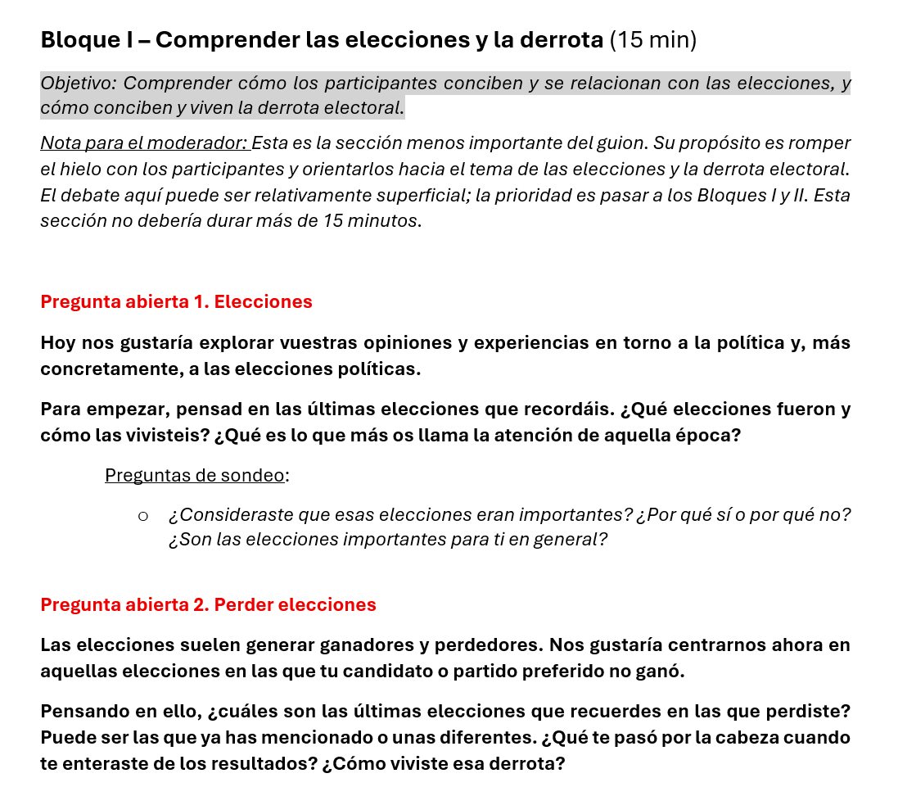
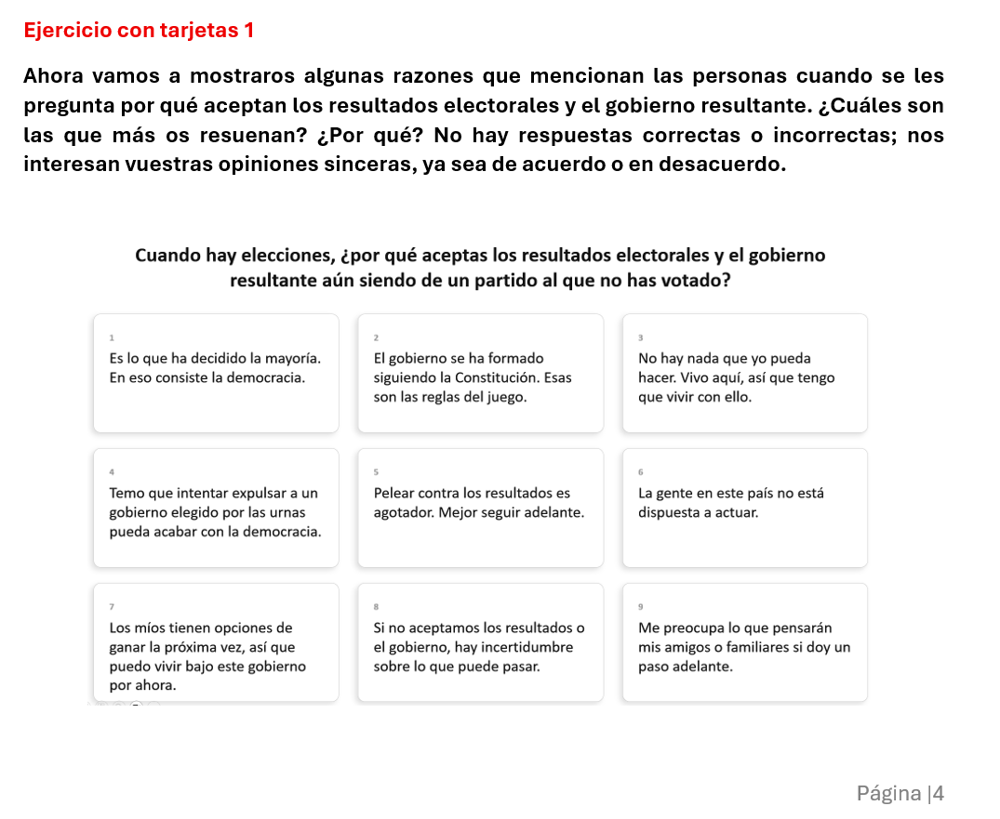
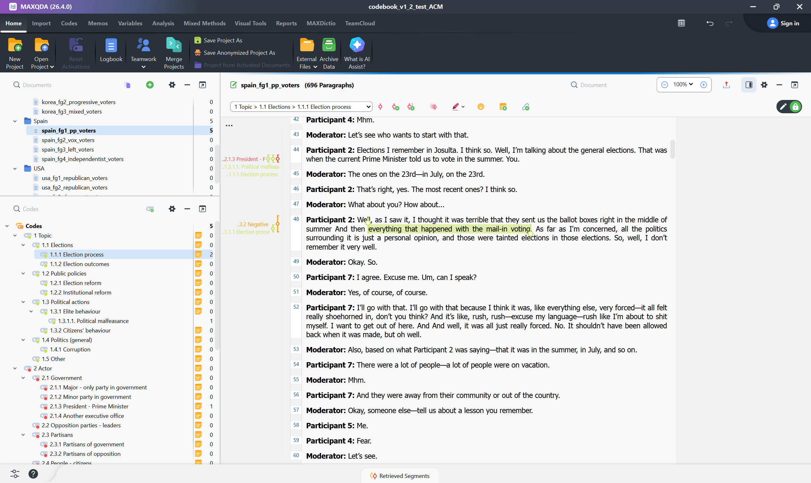
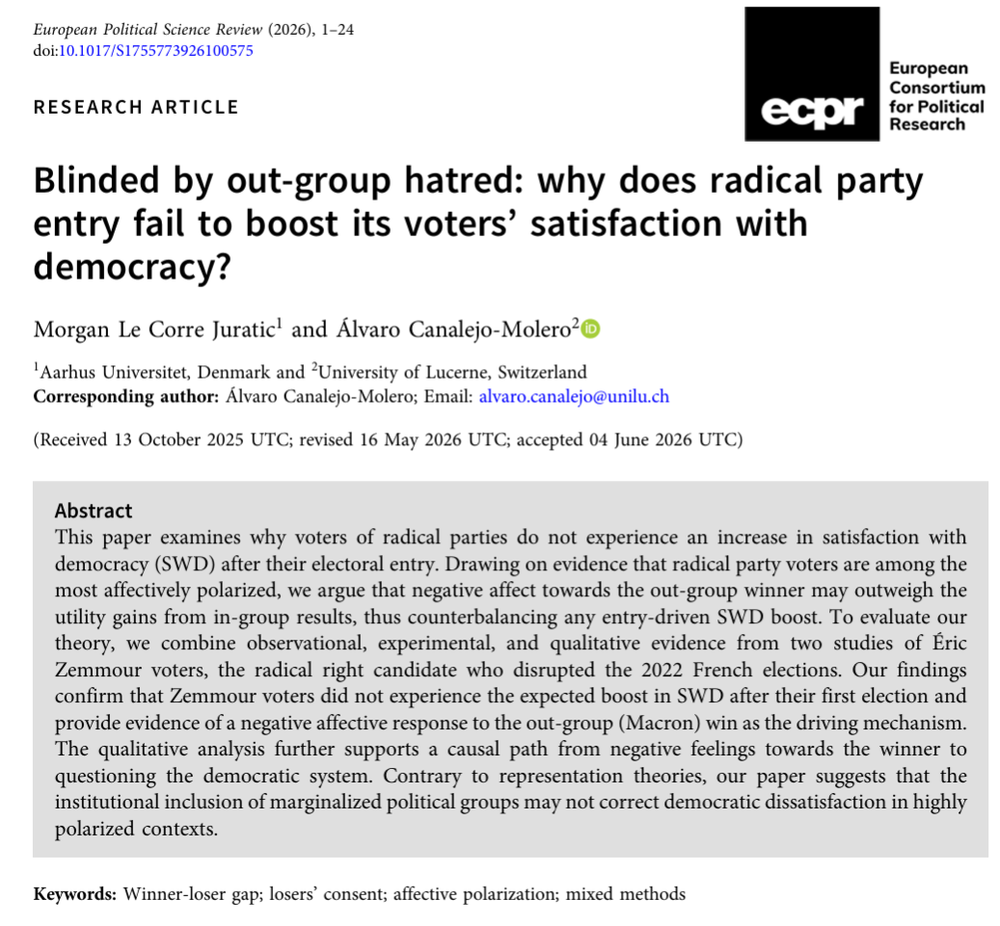

## Sobre mí

 

Postdoc en el [IPP-CSIC](https://www.ipp.csic.es), proyecto [CONSENT](https://cordis.europa.eu/project/id/101170551)

- Antes: postdoc en Lucerna; estancias en la UAB y la LSE

- Doctorado en el [EUI](https://www.eui.eu) (2023)

**Investigo** actitudes y comportamiento político
 
- Resultados electorales y consentimiento de los perdedores
- Cambio tecnológico digital y conflicto político
- Identidades múltiples y representación

::: notes

- Curso: Seminario de investigación (último año)

  + Objetivo: cómo escribir un paper desde cero, con un enfoque positivista y centrado en metodologías cuantitativas
  
  + Han visto: como plantear una pregunta de investigación, teoría e hipótesis, medición cuanti, etc.
  
- Esta clase: entrevistas (Sergi) y grupos de discusión (yo)

  + La clase dura hora y media (en torno a hora y diez al ser virtual y sin preguntas)
  
  + Mi parte debe durar 30/45 minutos organizada como una conversación con Sergi

- Más tarde: observación participante y etnografía

:::

## Qué son los grupos de discusión

- Conversación guiada en grupo sobre un tema de investigación

- Lo central es la **interacción**

- Objetivo: hacer emerger **significados compartidos**

. . .

| | Entrevista | Grupo |
|---|---|---|
| Se habla ante | El entrevistador | Moderador y pares |
| Obtenemos | Relatos individuales | Discursos comunes |

::: notes
 
- "Grupos focales" o "de discusión": los usamos indistintamente.

- No se trata tanto de que nos cuenten qué pasó, sino de hacer emerger discursos comunes.

:::

## CONSENT

[ERC Consolidator Grant](https://cordis.europa.eu/project/id/101170551) (2025-2030)

- Ignacio Jurado (IP), Josep Serrano Serrat y yo

::::: {.fragment}
:::: {.columns}

::: {.column width="45%"}
**RQs:** 

- ¿Por qué los perdedores aceptan los resultados electorales? 

- ¿Qué rompe ese consentimiento?
:::

::: {.column width="55%"}
{height="350px" fig-align="center"}
:::

::::
:::::

::: notes
- Contexto: asalto al Capitolio (2021) y a los Tres Poderes en Brasil (2023).

- Métodos: grupos de discusión, encuestas, análisis longitudinal y experimentos en unas 20 democracias.

- Tercera pregunta: consecuencias de la ruptura.
:::

## De dónde partimos

- Muchas teorías, **poco testadas**

- Pensadas sobre todo **para las élites** (ej., aceptan porque esperan ganar la próxima vez; porque el coste de contestar los resultados es mayor que las posibles ganancias, etc.)

. . .

¿Cuáles de estas teorías explican mejor el comportamiento ciudadano? 

. . .

¿Existen **otras explicaciones**?

## ¿Por qué grupos de discusión?

. . .

- Encuestas y experimentos: inferencias descriptivas y causales

. . .

- Grupos de discusión:

  + **Antes**: explorar ideas y preparar diseños cuantitativos
  
  + **Después**: interpretar resultados

. . .

- Objetivo inicial mixto:

  + Generación de teoría (*theory-building*)
  
  + Validación de teorías (*theory-testing*)
  

## Selección de casos

 

| País | Por qué |
|---|---|
| EE.UU. y Brasil | Retroceso democrático |
| España | Estabilidad con polarización |
| Hungría | Justo tras las elecciones |
| Corea del Sur | Ley marcial |
 
::: notes
- Criterio común: democracias con gran variedad geográfica y política.

- España: menos democracia en juego.

- Hungría sustituyó a Polonia.
:::

## Composición

 

| País | Grupos |
|---|---|
| Hungría (piloto) | 1 perdedores, 1 ganadores, 1 mixto |
| EE.UU. | 2 demócratas, 2 republicanos |
| Brasil | 2 Lula, 2 Bolsonaro |
| España | 1 izquierda, 1 PP, 1 Vox, 1 independentistas |
| Corea del Sur | 1 izquierda, 1 derecha, 1 mixto |
 
::: notes
 
- Mayoría homogéneos: facilitan que la gente hable con confianza.

- Mixtos: tentativo, para probar el conflicto entre ganadores y perdedores.

- Logística y reclutamiento: IPSOS.
:::

## El guion
 
- Parte 1 (inductiva): **experiencias** de elecciones y derrotas

- Parte 2 (deductiva): *juego* con explicaciones teóricas

. . .

:::: {.columns}

::: {.column width="50%"}
{height="450px" fig-align="center"}
:::

::: {.column width="50%"}
{height="450px" fig-align="center"}
:::

::::
 
::: notes
 
- Bloque 0: rompehielos. Bloque I: elecciones y perder. Bloque II: aceptar y dejar de aceptar (núcleo). Bloque III: tarjetas.

- Las tarjetas introducen mecanismos de la literatura que no salen solos.

- Lección del piloto en Hungría: demasiado reglado.

- El guion sufrió cambios específicos para distintos países.

- Guía **poco o mucho** según el objetivo
  
  + Descubrir: guía abierta
  
  + Cubrir temas: guía estructurada

- Trade-off: **apertura vs. desviación**; nosotros tendimos hacia abierta
:::
  
## Análisis con enfoque abductivo

1. Categorías **predefinidas**

2. Categorías **emergentes**

3. Ida y vuelta entre datos y teoría

. . .

**Libro de códigos**

- En construcción

- **Unidad**: cada idea con sentido propio y relevancia política

. . .

El **análisis** se realiza con software específico ([MAXQDA](https://www.maxqda.com))
 
::: notes
- Deja que Sergi te pare aquí en la parte del enfoque abductivo.

- Dimensiones: objeto, evaluación, consentimiento (postura, objeto, mecanismo, acción) e interacción.

- Varios códigos por fragmento. Se revisa en reuniones de equipo.
:::

##

{fig-align="center"}

## Extra: preguntas abiertas

:::: {.columns}

::: {.column width="45%"}
- Entre el análisis cualitativo y cuantitativo

- Mismo enfoque: codificar texto de manera abductiva

- Complementan resultados con explicaciones detalladas
:::

::: {.column width="55%"}
::: {.fragment}
{height="480px" fig-align="center"}
:::
:::

::::

::: notes

- Solo si da tiempo.
:::

## Gracias!

 

 

 

[alvaro.canalejo@cchs.csic.es](mailto:alvaro.canalejo@cchs.csic.es)

::: notes
 
Preguntas de Sergi:
 
- Diferencias con las entrevistas (ya cubierto!)

- Un artículo que me guste: hay poco, pero Boas, Hidalgo & Melo (2019) -	Norms versus action: Why voters fail to sanction malfeasance in Brazil, AJPS

:::

## Boas, Hidalgo y Melo (2019)

[*Norms versus Action*](https://people.bu.edu/tboas/norms_vs_action.pdf), AJPS

- **Puzzle**: castigan la corrupción en experimentos de viñeta, pero no en las urnas

- **Grupos de discusión** tras las elecciones en 3 municipios

  + La corrupción **no surge**: hablan de empleo, sequía y sanidad
  
  + Lealtad a **dinastías locales** como si fueran partidos

- Interpretan un resultado nulo y sugieren mecanismos que luego **testan con datos**

::: notes

- Experimento de campo en Pernambuco (2016) con el Tribunal de Cuentas: unos 3.200 votantes en 47 municipios. Folleto sobre si se aprobaron o rechazaron las cuentas del alcalde.

- Viñeta: la información reduce el apoyo 44 puntos. Experimento de campo: efecto nulo.

- Grupos en Tabira, Flores e Itaíba; uno de los autores asistió como observador.

- Ejemplo de uso "después": interpretar resultados cuanti.

:::
